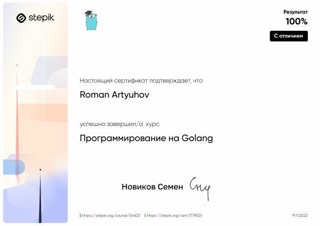

# Programming_in_Golang

Course: <a href="https://stepik.org/course/54403/info" rel="nofollow">https://stepik.org/course/100208/syllabus</a>

My cert: <a href="https://stepik.org/cert/1779501" rel="nofollow">https://stepik.org/cert/1779501</a>

